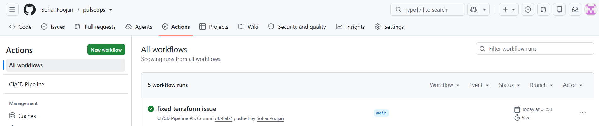
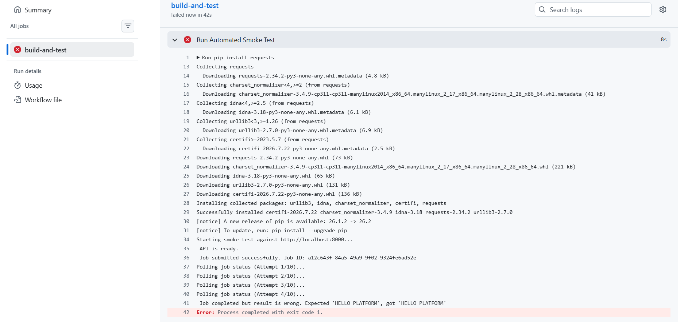
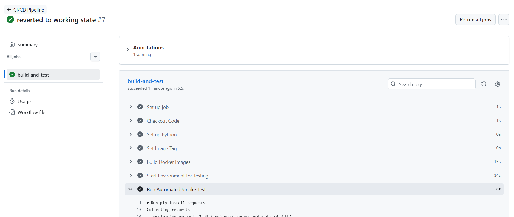
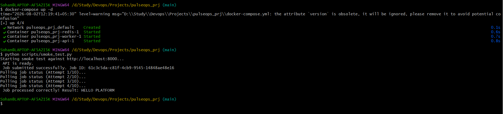

# PulseOps Platform Deployment

## Architecture Overview
The repository provides a reproducible deployment environment for the PulseOps application and the architecture is fully decoupled in order to ensure reliability and allow for independent scaling.
* **API (FastAPI):** Takes the incoming web requests and puts them into the task queue.
* **Queue (Redis):** Functions as an asynchronous message broker.
* **Worker (Python/RQ):** Carries out the jobs in the background.
* **Database (PostgreSQL):** Stores job states that need to last.

## Assumptions & Trade-offs
I went with Redis rather than AWS SQS for the queue so that the staging environment could be easily reproduced locally using Docker Compose.
**Database Scope:** For this local demonstration, the job states are stored in memory or Redis; in the case of a full AWS production deployment, an RDS PostgreSQL instance is used (refer to `infra/terraform/main.tf`).
* **Focus on CI/CD:** GitHub Actions is the main method of deployment and direct manual adjustments to the infrastructure are strictly avoided.

## Prerequisites & Local Setup
Make sure that Docker and Docker Compose have been installed.
2. Run `docker-compose up --build -d`.
3. The API can be accessed at http://localhost:8000.

## Automated Testing & Smoke Test
The automatic validation of the deployment takes place as part of the CI process using a smoke test.
To run it locally, type `python scripts/smoke_test.py`.

## AI Tool Disclosure
* **Tools Used:** Gemini
* **Where/How:** It is used for producing standard Terraform configurations and FastAPI routing structures.
* **Manual Review:** I checked over all the Dockerfile security contexts (making sure that non-root execution was used), made the Kubernetes readiness probes more strict, and prepared the logic for the CI/CD pipeline so as to guarantee immutable image tagging.

## Cost & Cleanup
* The estimated monthly cost for AWS is about $40 (for the t3.micro RDS, t3.micro ElastiCache, and basic VPC networking).
* **Cleanup:** Execute `terraform destroy -auto-approve` and `docker-compose down -v` in order to get rid of all the resources.

## Demonstration Evidence

To demonstrate the system functionality and reliability, I have included the following evidence:

### 1. Automated CI/CD Pipeline
The following image shows a successful run of the GitHub Actions pipeline, confirming that build, validation, and testing are fully automated.


### 2. Failure Catch & Rollback Demonstration
The pipeline is designed to catch regressions. The first image shows the pipeline failing after an intentional code break; the second shows the pipeline passing after the rollback/fix.
* **Failure Catch:** 
* **Rollback Success:** 

### 3. Automated Smoke Test Output
This shows the final output of the `smoke_test.py` script running locally, confirming end-to-end integration:
```bash
      Job processed correctly! Result: HELLO PLATFORM
```
* **Smoke Test Success:** 